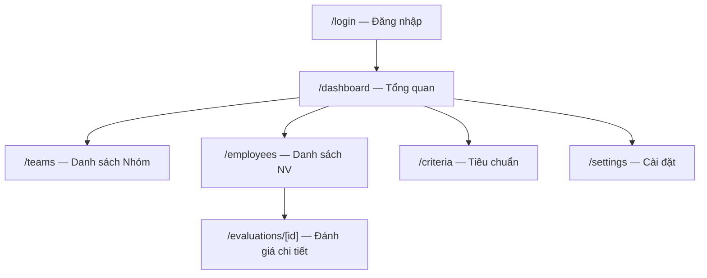
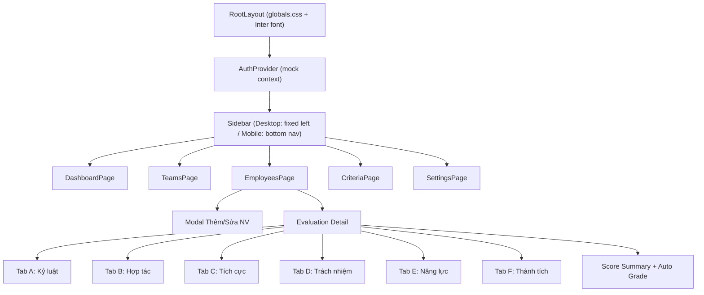
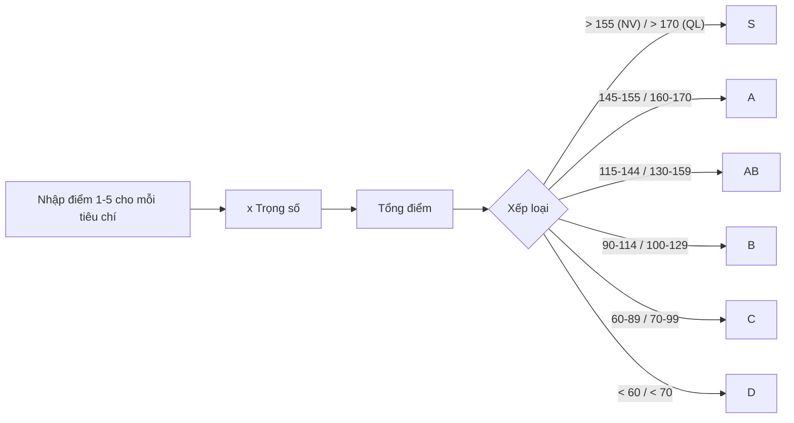

# Frontend Architecture — KURABE QAQC

## Sitemap & Routes

## Component Tree

## Shared UI Components

| Component | Mô tả |
|---|---|
| `StatusChip` | Pill badge cho S/A/AB/B/C/D với màu tương ứng |
| `ProgressBar` | Thanh tiến trình (8px, Corporate Teal) |
| `DataTable` | Bảng dữ liệu striped rows, 48px row height |
| `ScoreInput` | Input điểm 1-5 cho từng tiêu chí |
| `Modal` | Overlay dialog cho Thêm/Sửa nhân viên |
| `Card` | Panel trắng, border #E2E8F0, soft shadow |
| `StatCard` | Card thống kê cho Dashboard |

## Design Tokens (từ Stitch)

| Token | Value |
|---|---|
| Primary | `#0E4B66` (Corporate Teal) |
| Primary Light | `#C5E7FF` |
| Surface | `#F7F9FB` |
| On Surface | `#191C1E` |
| Outline | `#71787D` |
| Outline Variant | `#C1C7CD` |
| Error | `#BA1A1A` |
| Font | Inter (all weights) |
| Border Radius | `0.5rem` (8px default) |
| Grid | 8px base |
| Container Max | 1440px |

## Scoring Logic

