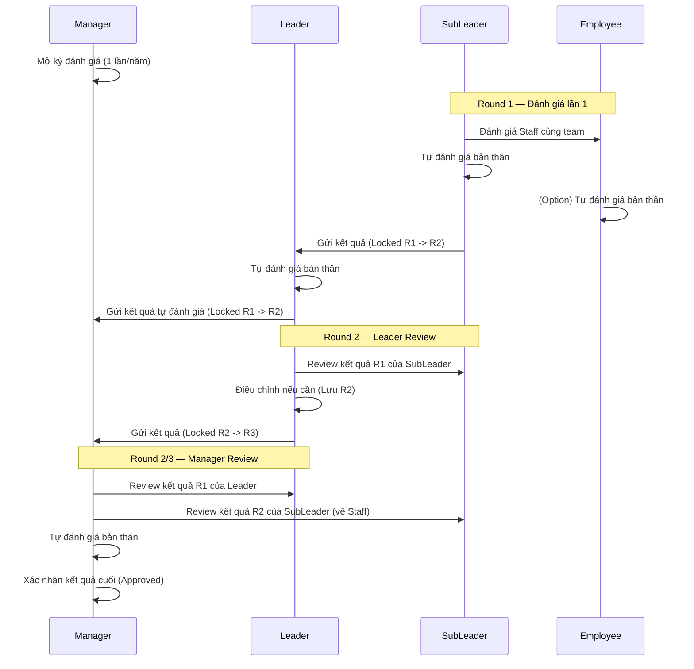

# MASTER PLAN — KURABE QAQC Evaluation System

> Webapp đánh giá nhân viên cuối năm cho bộ phận QAQC, tiêu chuẩn Nhật Bản.
> Stack: **Next.js 15 (App Router)** + **TailwindCSS v4** + **Local Mock Data** → Supabase (Phase sau)

## Phases

| Phase | Tên | Mô tả | Trạng thái |
|---|---|---|---|
| P1-P13 | Infrastructure & UI | Setup core, login, dashboard, teams, employees, criteria, evaluation core, polish | `[x]` |
| P14 | Workflow Data Model | Refactor data model: EvaluationPeriod, Multi-round Evaluation, EvaluationRound, phân quyền theo Role | `[x]` |
| P15 | Workflow Engine | State machine, phân quyền đánh giá/review, lock sau gửi, luồng gửi/nhận thông báo | `[x]` |
| P16 | Multi-round UI | CriteriaTab overlay đa tầng, badge phân biệt lần đánh giá, notification, dashboard cập nhật | `[ ]` |

## Workflow Đánh giá (Business Rules)

## Business Rules (Tóm tắt từ PRD)
- **3 vai trò**: Manager → Leader → SubLeader
- **3 lần đánh giá**: SubLeader đánh giá R1 → Leader review R2 → Manager review R3
- **6 nhóm tiêu chí**: A (Kỷ luật), B (Hợp tác), C (Tích cực), D (Trách nhiệm), E (Năng lực), F (Thành tích)
- **Thang xếp loại**: S > A > AB > B > C > D (điểm cắt khác nhau cho NV vs Quản lý)
- **Lock rule**: Sau khi "Gửi" → không thể chỉnh sửa, cấp trên nhận thông báo
- **Overlay rule**: Cấp cao hơn đánh giá lại → load điểm cũ + badge/chấm màu khác để phân biệt
